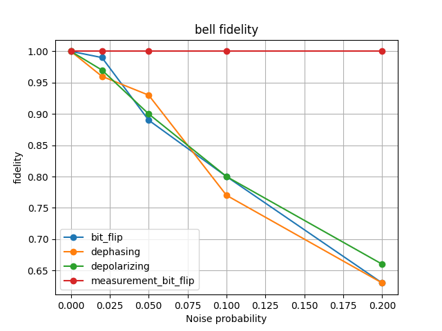
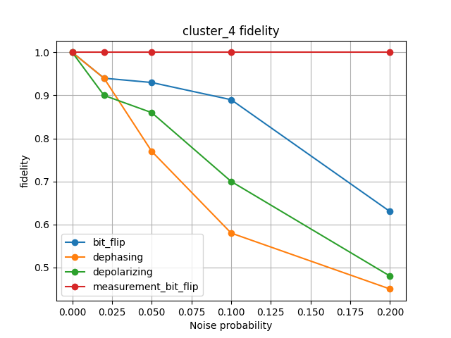
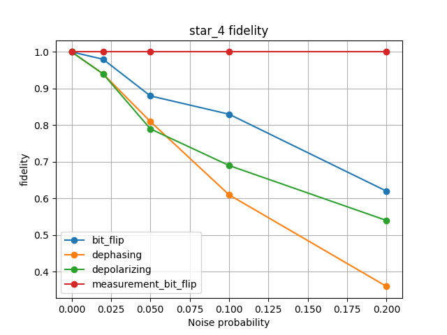

# Graph State Noise Benchmark


This is a small Python project for testing simple graph-state quantum states with basic noise models.

I made this project to practice graph states, simple quantum noise, and basic benchmark metrics. The simulation is written mostly with NumPy, without using Qiskit for the main part.

## What the project does

The project builds three graph states:

- Bell graph state
- 4-qubit star graph state
- 4-qubit line cluster state

Then it applies these noise models:

- bit-flip noise
- dephasing noise
- depolarizing noise
- measurement bit-flip noise

After that, it compares the ideal state and the noisy state using:

- fidelity
- total variation distance

The benchmark script runs all of these cases together in one batch and saves the results.

## Basic idea

A graph state starts with all qubits in the plus state.

Then the code applies a controlled-Z gate between qubits that are connected by an edge.

For example:

Bell graph:

0 --- 1

4-qubit line cluster:

0 --- 1 --- 2 --- 3

4-qubit star graph:

    1
    |
2 --0-- 3

## Project files

The main code is inside:

src/graph_noise/

The files are:

- states.py: creates basic quantum states like |0>, |1>, |+>, and multi-qubit states
- operators.py: contains quantum gates like Pauli gates, Hadamard, and controlled-Z
- operations.py: applies gates to selected qubits
- graphs.py: builds the graph states
- noise.py: contains the noise models
- metrics.py: calculates fidelity, probabilities, and total variation distance
- simulation.py: runs the benchmark logic

The examples folder contains:

- run_benchmarks.py: runs all benchmarks in one batch and saves the results
- plot_results.py: makes plots from the saved results

The tests folder contains basic tests for the project.

## Installation

Create a virtual environment:

python -m venv .venv

Activate it on Windows PowerShell:

.venv\Scripts\Activate.ps1

Install the needed packages:

pip install -r requirements.txt

## How to run

Run the benchmark:

python examples/run_benchmarks.py

This saves the results here:

results/benchmark_results.csv

Then make the plots:

python examples/plot_results.py
## Django web interface

I also added a small Django interface for running one benchmark from a webpage.

From the project root, install the requirements:

```bash
pip install -r requirements.txt
```
Then run the web app:
```bash
cd webapp
python manage.py runserver
```
Open
```bash
http://127.0.0.1:8000/
```
The page lets the user choose a graph state, a noise model, a noise probability, and the number of repeated runs. It then displays the benchmark name, fidelity, total variation distance, number of qubits, number of edges, and a simple depth estimate.'

The Django interface calls the existing simulation code through src/graph_noise/web_runner.py, so the web layer stays separate from the core benchmark logic
### Interface preview
Below is a screenshot of the Django page after running one benchmark from the browser.


## Example fidelity plots

Below are example fidelity plots for the Bell, 4-qubit cluster, and 4-qubit star graph states.

### Bell state



### 4-qubit cluster state



### 4-qubit star state




## Example output

The benchmark prints results like this:

bell | bit_flip | p=0.0 | fidelity=1.0 | tvd=0.0  
bell | bit_flip | p=0.02 | fidelity=0.98 | tvd=0.0  
bell | bit_flip | p=0.05 | fidelity=0.91 | tvd=0.0  

The exact numbers can change because some of the noise models are random.

Sometimes the total variation distance stays close to zero. This can happen because the measurement probabilities may stay almost the same, even when the quantum state itself changes.

## Tests

The tests check simple things, such as:

- basic states are correct
- graph states have the expected size
- graph states are normalized
- noise with probability zero does not change the state
- metric functions give expected values

Run the tests with:

python -m pytest -v
